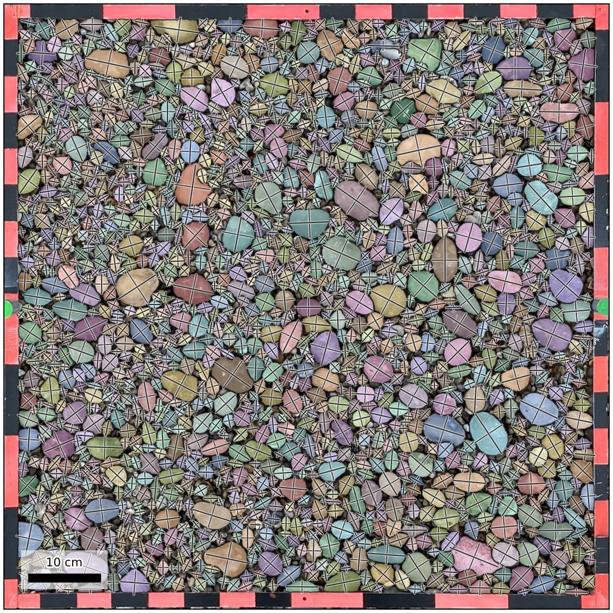

# Segment Every Grain as a PebbleMapper detection model

This plug-in lets [PebbleMapper](https://github.com/soloyant/pebblemapper) detect clasts
with [segmenteverygrain](https://github.com/zsylvester/segmenteverygrain) (Sylvester et
al., 2025). In segmenteverygrain, a small U-Net proposes grain locations and Meta's
Segment Anything 2.1 (SAM 2.1) turns each proposal into an outline. The adapter runs the
model in its own conda environment (`pm-seg`), receives the outlines as a label image
and hands them to PebbleMapper, which measures every clast with its own measurement
step. Sizes are therefore defined exactly as for PebbleMapper's built-in Mask R-CNN
model. Nothing in PebbleMapper is modified.

The repository holds the adapter (built on PebbleMapper's `InstanceSubprocessBackend`),
the script that runs inside the `pm-seg` environment and the environment file. The
weights are not included; a script downloads them from their authors.

## Requirements

- A working PebbleMapper installation.
- Conda (Miniconda or Anaconda).
- About 6 GB of disk space for the environment (PyTorch, TensorFlow, SAM 2 and
  segmenteverygrain) and about 925 MB for the weights.
- An NVIDIA GPU is recommended. With SAM 2.1 large, the model uses about 1.5 GB of GPU
  memory. On a machine without an NVIDIA GPU, install the CPU build of PyTorch instead;
  detection is then slower.

## Installation

1. Create the environment and install the packages. `sam2` is a source distribution, so
   install PyTorch first and build `sam2` without isolation. From this folder:

   ```bat
   conda create -y -n pm-seg python=3.11 pip
   conda activate pm-seg
   pip install torch==2.5.1+cu121 torchvision==0.20.1+cu121 --index-url https://download.pytorch.org/whl/cu121
   pip install tensorflow==2.19.1
   set SAM2_BUILD_CUDA=0
   pip install --no-build-isolation sam2==1.1.0
   pip install segmenteverygrain==0.5.0 "matplotlib<3.9" pillow-heif
   ```

   `environment.yml` lists the same versions for reference.

2. Download the two weight files into `weights/`:

   ```bat
   python scripts\download_weights.py
   ```

   The script fetches `seg_model_smooth_labels.keras` from the segmenteverygrain
   repository and `sam2.1_hiera_large.pt` from Meta on Hugging Face. Set
   `PM_SEG_WEIGHTS` to store them elsewhere.

3. Declare the backend in PebbleMapper's `user_detectors.json`. Copy
   `user_detectors.example.json` and set `path` to the folder of this repository:

   ```json
   [
    {"module": "pm_seg_backend.backend", "factory": "make_backend",
     "path": "C:/path/to/pebblemapper-backend-segmenteverygrain"}
   ]
   ```

4. Restart PebbleMapper.

## Usage in PebbleMapper

After the restart, **Segment Every Grain (Sylvester)** appears in the **Detection model**
selector in the left panel, next to Mask R-CNN. Select it and run detection as usual. The
result is the same per-clast table as with Mask R-CNN.

| | Mask R-CNN (built in) | Segment Every Grain |
|---|---|---|
| Runs in | PebbleMapper's own environment | its own conda environment `pm-seg` |
| Trained for | clasts on the beach photographs of the PebbleMapper project | grains in general |
| Confidence score | yes | none; `Score` holds the mean U-Net grain probability under the outline, and *Filter by confidence* is not applied |
| Quadrat mode | yes | yes (whole photograph) |
| Ortho mode | tiles, resume, nodata and ROI filters, deduplication | patches and merges across seams itself; no resume, no tile filters, no ROI |

Points to note:

- **Framed quadrat photographs.** The model segments every grain-like object, including
  the coloured bars of a quadrat frame and rulers. A photograph rectified by
  PebbleMapper's Orthorectify carries the frame's thickness in its sidecar, and the frame
  band is left out automatically. For any other framed photograph, draw an *ROI per
  image* (Detect tab).
- **iPhone HEIC photographs** are passed to the model as a PNG copy by PebbleMapper.
- **Smaller SAM 2.1 checkpoints** (`sam2.1_hiera_base_plus.pt`, 323 MB, and smaller)
  also work. Point `PM_SEG_SAM_CKPT` and `PM_SEG_SAM_CFG` at them.
- **Model options.** segmenteverygrain's own options (`min_area`, `dbs_max_dist`,
  `min_grain_area`, `patch_size`, `overlap`, `remove_edge_grains`, `use_sam`,
  `dilation`) are passed through the `PM_SEG_OPTIONS` environment variable as JSON.

PebbleMapper writes the model's name, version and licence into every run's
`.manifest.json`.

## Licences

This repository contains only the adapter. The model code is installed by pip from its
published releases, and the weights are downloaded by `scripts/download_weights.py`.

| Component | Copyright | Licence |
|---|---|---|
| This adapter | © 2026 Antoine Soloy | MIT (`LICENSE`) |
| segmenteverygrain 0.5.0 (code) | © 2023 Zoltán Sylvester | Apache-2.0 |
| `seg_model_smooth_labels.keras` (U-Net weights) | © 2023 Zoltán Sylvester | Apache-2.0 |
| SAM 2 (code, `sam2` 1.1.0) | © Meta Platforms, Inc. | Apache-2.0 |
| `sam2.1_hiera_large.pt` (SAM 2.1 weights) | © Meta Platforms, Inc. | Apache-2.0 |

The adapter is an independent project and is not affiliated with or endorsed by the
authors of segmenteverygrain or SAM 2.

## Citation

If you use this model, cite the segmenteverygrain paper:

Sylvester, Z., Stockli, D. F., Howes, N., Roberts, K., Malkowski, M. A., Poros, Z.,
Martindale, R. C., & Bai, W. (2025). Segmenteverygrain: A Python module for segmentation
of grains in images. *Journal of Open Source Software*, 10(112), 7953.
https://doi.org/10.21105/joss.07953

Also cite SAM 2 (Ravi et al., 2024).

## The same photograph through every model

The figures below show the same rectified quadrat photograph (`example_03_Etretat`,
IMG_0955: 0.84 m frame, 0.567 mm/px) run through every model PebbleMapper can run, with
the frame band left out and each clast measured by PebbleMapper's own step.

| Model | Detections | Hand-outlined clasts found | Detections that match one | Length RMSE | D50 | D84 | Time per photograph |
|---|---|---|---|---|---|---|---|
| Hand outlines | 1,362 | | | | 17.7 mm | 26.5 mm | |
| Mask R-CNN (PebbleMapper, built in) | 324 | 320 (24 %) | 99 % | 1.6 mm | 20.2 mm | 34.2 mm | 41 s (GPU) |
| Segment Every Grain | 1,822 | 1,350 (99 %) | 74 % | 1.0 mm | 17.7 mm | 26.3 mm | 259 s (GPU) |
| ImageGrains | 2,034 | 1,316 (97 %) | 65 % | 1.7 mm | 17.2 mm | 26.0 mm | 51 s (CPU) |
| PebbleCountsAuto | 605 | 491 (36 %) | 81 % | 4.1 mm | 21.0 mm | 35.3 mm | 17 s (CPU) |

Detections are paired with the 1,362 hand-outlined clasts by position and size, as PebbleMapper's
Validate tab does. The hand outlines started from Segment Every Grain's detections, which favours
that model here. Times are for one photograph once the model is loaded (loading adds 20 to 70 s
once per run), on a 2018 laptop (Intel Core i7-8850H, NVIDIA Quadro P600 with 4 GB).

<p align="center">
  
</p>
<p align="center"><em>This model's detections on the example quadrat: each clast filled and outlined, its long and short axes drawn.</em></p>

<p align="center">
  
</p>
<p align="center"><em>The four models side by side on the same photograph.</em></p>

<p align="center">
  
</p>
<p align="center"><em>Cumulative distributions of clast length, D50 (circle) and D84 (square) marked; the grey band is the 8-pixel detection limit of this photograph.</em></p>
